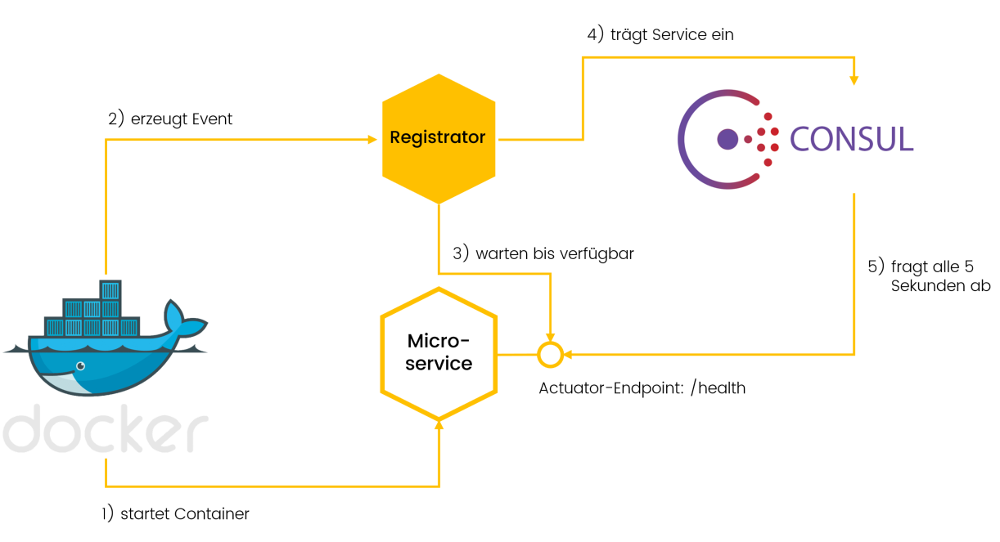

# Microservice Discovery

Der Registrator ist eine aktive Komponente, der als Integrationsmechanismus zwischen Docker und Consul fungiert und Microservices nach dem Start/Stop mit der Registry synchronisiert:

1. Docker startet einen neuen Container nachdem dieser aus der CI-Pipeline gepurzelt ist.
2. Nach dem erfolgreichen Start schreibt Docker mehrere Events (z. B. Netzwerk- und Volume-Ereignisse) in die Streaming API, auf die sich der Registrator abonniert hat.
3. Der Registrator untersucht die Docker-Events und stellt (z. B. anhand der Container-Labels) fest, ob es sich tatsächlich um einen Microservice handelt. Wenn der Container gestartet ist, heißt das aber noch lange nicht, dass der enthaltene Microservice auch schon bereit ist: deshalb wartet der Registrator, bis der health-Endpoint (Actuator im Spring Sprachgebrauch) abfragbar ist.
4. Der Registrator trägt den Service per API in Consul ein und gibt dabei auch die URL des health-Endpoints mit (Konvention: Port + 1, polling durch Consul alle 10 Sek, Timeout 1 Sek, http response 200 wird erwartet)
5. Nun kann Consul von sich aus in bestimmten Intervallen feststellen, ob der Service noch verfügbar ist und diesen ggf. austragen.